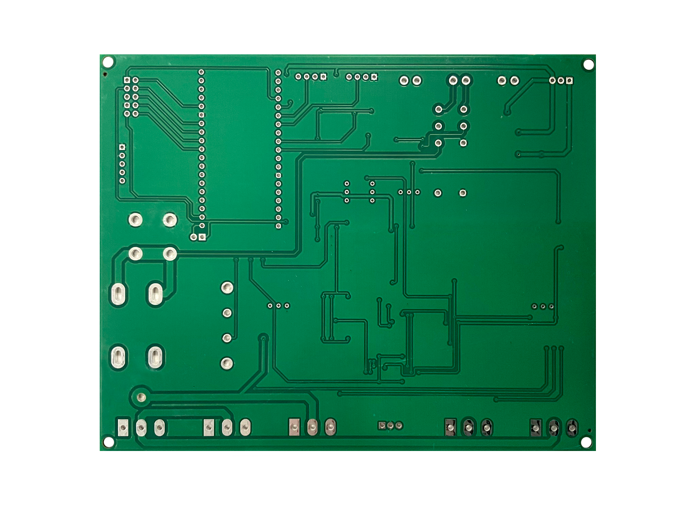

# Index

## General Description
This project is an electronic load designed as a final project for electronic engineering. The device allows simulation of different load conditions to validate power supplies, batteries, and electronic components. It offers both local and remote control, as well as multiple operating modes.

## Project Objectives
- Develop a versatile and economical electronic load
- Implement precise digital control with real-time feedback
- Facilitate user interaction through modern interfaces (lcd screen and web)

## Device Gallery

### PCB
<!-- PCB front and back photos side by side -->
<table>
  <tr>
    <td></td>
    <td></td>
  </tr>
  <tr>
    <td align="center">Front of PCB</td>
    <td align="center">Back of PCB</td>
  </tr>
</table>

### Label

## Documentation Navigation

- [🔧 Hardware](./hardware.md): Components, connections, physical design and assembly
- [💻 Software](./software.md): Code, control logic, FSM, graphical interface and web server
