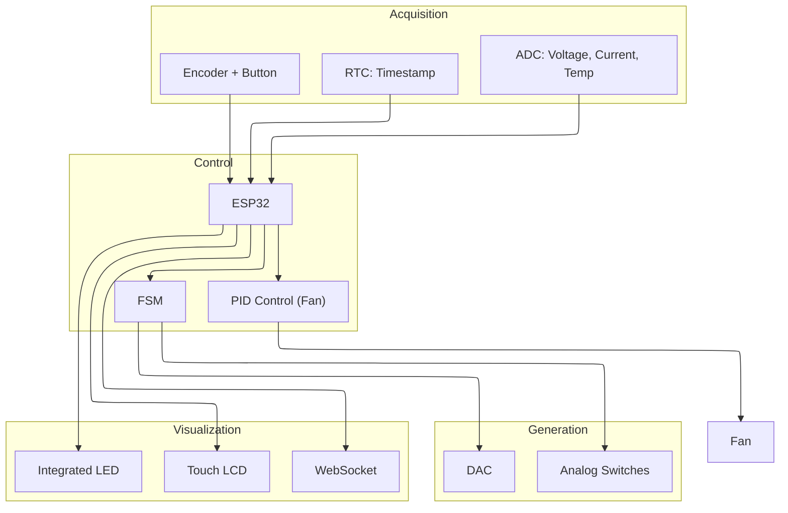

<script type="module">
  import mermaid from 'https://cdn.jsdelivr.net/npm/mermaid@11/dist/mermaid.esm.min.mjs';
  mermaid.initialize({ startOnLoad: true });
</script>

## Electronic Load System Overview

### Purpose and Scope

The electronic load system is a versatile testing device designed to simulate various electrical loads for power supply testing, battery characterization, and other electronic component validation. It operates in multiple modes (Constant Current, Constant Voltage, Constant Resistance, Constant Power) and provides precision control through both a local touchscreen interface and a remote web interface.

---

## System Capabilities

| Feature                | Description                                                                                 |
| ---------------------- | ------------------------------------------------------------------------------------------- |
| **Operating Modes**    | Constant Current (CC), Constant Voltage (CV), Constant Resistance (CR), Constant Power (CW) |
| **User Interfaces**    | Local LCD touch interface and web-based remote interface                                    |
| **Precision Control**  | Digital control of load parameters with real-time feedback                                  |
| **Thermal Management** | PID-controlled fan with temperature monitoring                                              |
| **Data Monitoring**    | Real-time voltage, current, power, resistance, and temperature measurements                 |
| **Time Tracking**      | Energy consumption measurement and session uptime tracking                                  |

---

## High-Level System Architecture

```
flowchart LR
 subgraph subGraph0["User Interface"]
    direction TB
        C1["Encoder Reading"]
        C["User Interface"]
        C2["LCD Display Update"]
        C3["WebServer Communication"]
  end
 subgraph subGraph1["Power Control"]
    direction TB
        D1["ADC Reading"]
        D["Power Control"]
        D2["Parameter Calculation"]
        D3["DAC Configuration"]
  end
 subgraph subGraph2["Monitoring and Protection"]
    direction TB
        E1["Temperature ADC Reading"]
        E["Monitoring and Protection"]
        E2["Fan Control"]
        E3["Overload Protection"]
  end
    A["Start"] --> B["System Initialization"]
    B --> C & D & E
    C --> C1 & C2 & C3
    D --> D1 & D2 & D3
    E --> E1 & E2 & E3
```

* **ADC**: Measures voltage, current, and temperature
* **DAC**: Controls the load level
* **Analog Switches**: Configures operating mode and relays
* **Fan & PID Controller**: Manages cooling based on temperature feedback
* **RTC**: Tracks time for energy and uptime measurements

---

## Key Components & Data Flow



---

## Main Loop Operations

The main control loop performs several critical operations during each iteration:

```
sequenceDiagram
    participant Main as "Main Loop"
    participant Meas as "Measurements"
    participant FSM as "FSM"
    participant Fan as "Fan Control"
    participant UI as "UI Updates"
    participant WS as "WebSocket"
    loop Each loop iteration
        Main->>Meas: Read voltage, current, and temperature
        Note right of Meas: Calculate power, resistance
        Main->>FSM: Run FSM with updated measurements
        Note right of FSM: Execute mode-specific operations
        FSM-->>Main: Update outputs (DAC, relays)
        Main->>Fan: Update PID controller
        Note right of Fan: Adjust fan speed based on temperature
        Main->>UI: Update LCD screen
        Main->>WS: Send status updates
    end
```

---

## Operating Modes

* **Constant Current (CC)**: Maintains a user-defined current
* **Constant Voltage (CV)**: Maintains a user-defined voltage
* **Constant Resistance (CR)**: Simulates a fixed resistance
* **Constant Power (CW)**: Maintains constant power dissipation

Each mode uses specific DAC settings and switch configurations, managed by the FSM.

---

## User Interfaces

### LCD Touch Interface

* Built with LVGL
* Main menu for mode selection
* Mode-specific screens for parameter adjustment
* Real-time measurements & status indicators

### Web Interface

* ESP32-hosted web server
* WebSocket for real-time updates & JSON commands
* Full remote control of modes & settings

---

## Control & State Management

* **FSM States**: `MAIN_MENU`, `CC`, `CV`, `CR`, `CW`, `SETTINGS`
* **Transitions**: Encoder/button or WebSocket commands
* **Actions**: Configure hardware and update UI based on state

---

## Hardware Components

| Component                   | Class                      | Purpose                                |
| --------------------------- | -------------------------- | -------------------------------------- |
| Digital-to-Analog Converter | `DAC`                      | Controls load level via gate voltage   |
| Analog-to-Digital Converter | `ADC`                      | Measures voltage, current, temperature |
| Analog Switches             | `AnalogSws`                | Configures mode-select relays          |
| Cooling Fan                 | `Fan` & `PIDFanController` | Maintains safe temperature             |
| Real-Time Clock             | `RTC`                      | Tracks time for energy & uptime        |
| LCD Display                 | `LVGL_LCD`                 | Touchscreen UI                         |
| Rotary Encoder              | `Encoder`                  | User input for parameter selection     |

---

## Development Environment

* **PlatformIO** (ESP32 target)
* **Libraries**:

  * LVGL & TFT\_eSPI for LCD
  * AsyncTCP & ESPAsyncWebServer for web interface
  * ArduinoJson for JSON handling
* **Version Control**: Git (src/main.cpp, etc.)

---

## Conclusion

The electronic load system offers a modular and extensible platform for testing power supplies, batteries, and electronic components. With four operating modes, dual user interfaces, real-time feedback, and robust thermal management, it serves both educational and professional applications as a versatile test instrument.
